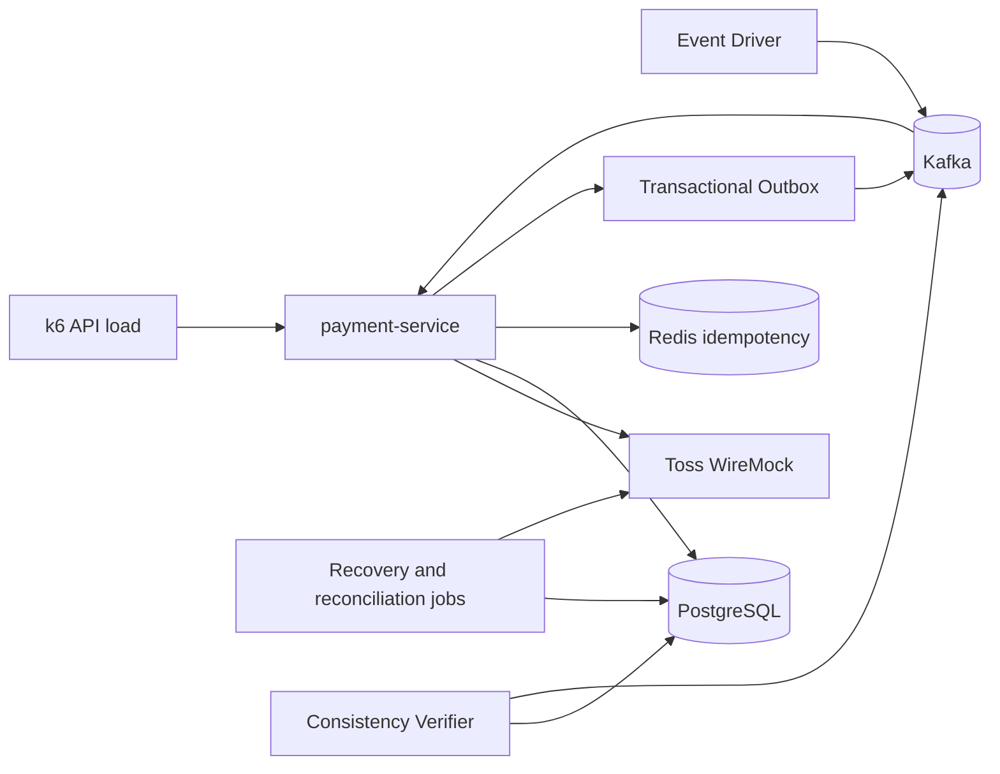

# OMC-payment

[OMC 커머스 프로젝트](https://github.com/SOLDOUT-2/OMC)에서 결제 서비스를 분리해 PG 장애 복구, 이벤트 정합성, 처리량 한계와 수평 확장 시 동작을 검증한 프로젝트입니다. 전체 커머스 시스템을 재현하기보다 결제 서비스와 검증 도구를 독립적으로 배포하고 장애 시나리오를 반복 측정할 수 있도록 구성했습니다.

## 구성

## 모듈

| 경로 | 역할 |
| --- | --- |
| `payment-service` | 결제 상태 머신, 승인·취소, Inbox·Outbox, UNKNOWN 복구와 PG–DB 대사 |
| `payment-test-tools` | Kafka 이벤트 발행과 Payment·Outbox·완료 이벤트 정합성 검증 |
| `common`, `arch-rules` | 공통 계약과 모듈 의존성 검증 규칙 |
| `simulators/toss-pg` | timeout, connection reset, 응답 유실을 재현하는 WireMock PG |
| `load-test` | API·Kafka k6 시나리오와 lag·Prometheus·DB 검증 스크립트 |
| `observability` | 로컬 Prometheus·Grafana 구성과 대시보드 |
| `deploy/gcp`, `infra/gcp` | 역할별 Compose와 Terraform 기반 GCP 벤치마크 환경 |

## 핵심 설계

- 승인·취소 결과가 모호한 구간을 `CONFIRM_UNKNOWN`, `CANCEL_UNKNOWN`으로 분리하고 PG 재조회와 망취소로 최종 상태 수렴
- Redis 멱등키와 Kafka Inbox로 중복 요청·소비를 방어하고, 트랜잭션 Outbox로 DB 상태와 발행 이벤트의 원자성 확보
- Apache HttpClient5 connection pool과 Resilience4j Bulkhead로 PG timeout의 TCP·요청 스레드 점유 격리
- TTL 만료, UNKNOWN 복구, PG–DB 대사 결과를 상태 이력과 append-only 대사 결과로 추적

## 검증 결과

각 수치는 WireMock 기반 격리 환경의 결과이며 실제 PG 성능을 의미하지 않습니다.

| 검증 | 조건 | 결과 |
| --- | --- | --- |
| UNKNOWN 최종 수렴 | 단일 2 vCPU, 150 RPS·60초, 승인 timeout 20% | 9,001건 중 `CONFIRM_UNKNOWN` 1,760건 전량 `PAID`, 미해결·중복 0건 |
| API 포화 구간 | 단일 2 vCPU, 정상 승인 250 RPS·60초 | p95 1,018.48ms, dropped 93건으로 200~250 RPS 사이 포화 전환 확인 |
| Kafka 소비 병렬성 | 단일 4 vCPU, 300 EPS·60초, 10/10→14/14 | 250.73→299.98 EPS, peak lag 2,347→685건 |
| 동일 자원 배치 비교 | 1×4 vCPU와 2×2 vCPU, 전체 consumer 8개 | 244.84→186.66 EPS로 감소했지만 두 구성 모두 중복·DLT 없이 최종 수렴 |

추가로 Outbox publisher가 입력 경로와 무관하게 약 17 events/s에 머무는 후속 병목과, 다중 인스턴스 UNKNOWN 스케줄러의 중복 PG 조회·낙관적 락 충돌을 재현했습니다. 아직 개선 전인 항목은 성과로 포장하지 않고 후속 과제로 분리했습니다.

## 테스트 진행 과정

| 실험 단계 | 조건 변화 | 다음 판단 |
| --- | --- | --- |
| [API 안정 구간 탐색](docs/performance/api/01-normal-load-ramp.md) | 정상 승인 100→300 RPS | 200~250 RPS 사이 포화 전환 확인 |
| [장애 혼입과 후속 복구](docs/performance/api/02-timeout-load-ramp.md) | PG 승인 timeout 20% 혼합 | 150 RPS 안정, 복구 처리량 별도 측정 |
| [Kafka 병렬성 조율](docs/performance/kafka/02-concurrency-tuning-2vcpu.md) | 1→16 partitions·consumers | 소비 직렬화 해소 후 2 vCPU 한계 확인 |
| [스케일업 재조율](docs/performance/kafka/03-scaleup-tuning-4vcpu.md) | 2→4 vCPU, 10→14 consumers | CPU와 처리 슬롯을 함께 늘려 300 EPS 추종 |
| [동일 자원 배치 비교](docs/performance/scaling/01-topology-comparison.md) | 1×4 vCPU→2×2 vCPU | 처리량보다 장애 격리와 N-1 용량을 확장 기준으로 분리 |
| [다중 인스턴스 장애 검증](docs/performance/resilience/02-scheduler-contention.md) | 스케줄러 실행 강제 중첩 | UNKNOWN 중복 PG 조회와 Batch 경합 재현 |

전체 측정 순서, 비교 기준과 원본 보관 정책은 [성능 테스트 결과](docs/performance/README.md)에 정리했습니다.
